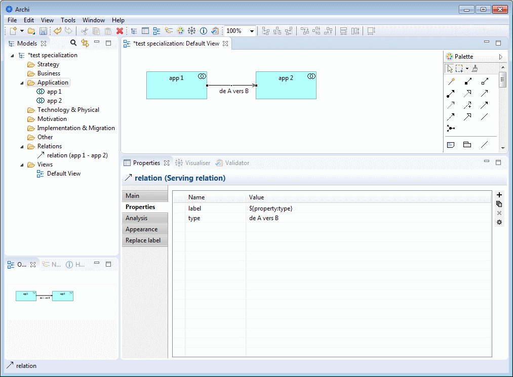

# specialization-plugin
The specialization plugin is designed to specialize concepts (figure, icon, etc.) inside Archi.

It allows one to replace icons and labels of Archi components in a view and/or the model tree. This is done by configuring the properties of Archi elements. 

This plugin is compatible with all my other plugins and with the GitHub persistence plugin. Archi users who open a model, but don't have the specialization images or plugin will just see the standard icons.

### Installation procedure
To install the plugin, just download the .jar file to Archi's **_plugins_** folder and (re)start Archi.

### Configuring the plugin
On Archi's preferences pages, you can:
1. Check and automatically install new versions of the plugin
2. Choose whether element icons and labels are replaced in Archi's views and/or model tree always, never, or according to the element's properties. This option can also be configured from inside Archi. 
3. Specify the folders that contain images to be used by the plugin
4. Create a log file for debugging purpose

### Changing components icons
Create a property called **_icon_** for an element and set this property's value to the path of your image file using the location specified in your settings configuration. 
For instance, if you've got a file plugins/com.archimatetool.editor_4.0.3.201707201522/img/logistic/factory.png, simply write logistic/factory.png

 

The following file types are supported:
* JPG
* PNG 
* GIF
* BMP

You can change an icon's size using a property called **_icon size_** with "width x height" format or "auto" value to fit to the element's rectangle.
You may change the icon location using a property called **_icon location_** with "x , y" format or "center" value to center the image in the element's rectangle

Note: Transparent colors are supported when one is specified in the image file.

### Changing component labels
You can either enter the label variable you would like displayed in the "Replace Label" option when selecting an element that's in a view, or by creating a property called **_label_** and setting its value to the varible you would like to display. For example, ${name} will display the name of the element in a view, while ${documentation} will display the element's documentation in a view. 

You can chain together label variables as well, such as ${name}${documentation}.
 If you would like to change the spacing and location of the label, use \n, \t, or spaces to do so in between property values.
 Additionally, you can display other property values by using ${property:YOUR_PROPERTY}, with YOUR_PROPERTY being another existing property for that element. It is possible to replace labels for relationships, not just elements, however this is treated the same way as setting element properties. 

